---
# Comprehensive Image Processing Tool

## Table of Contents
- [Introduction](#introduction)
- [Features](#features)
  - [1. Image Filter and Noise](#1-image-filter-and-noise)
  - [2. Edge Detection](#2-edge-detection)
  - [3. Normalization](#3-normalization)
  - [4. Histograms and Cumulative Distribution Function (CDF)](#4-histograms-and-cumulative-distribution-function-cdf)
  - [5. Image Mixer](#5-image-mixer)
  - [6. Active Contour](#6-active-contour)
  - [7. Hough Transform](#7-hough-transform)
  - [8. Harris and Lambda-minus](#8-harris-and-lambda-minus)
  - [9. Image Matching](#9-image-matching)
  - [10. Thresholding](#10-thresholding)
  - [11. Segmentation](#11-segmentation)
  - [12. Face Detection](#12-face-detection)
  - [13. Face Recognition](#13-face-recognition)

---

## Introduction
This project is a comprehensive computer vision tool that implements various computer vision tasks, including image processing, segmentation, face detection, face recognition, image matching, and thresholding.

## Features

### 1. Image Filter and Noise
Users can add and remove noise from images using various methods. The toolkit supports noise addition such as **Uniform**, **Gaussian**, and **Salt and Pepper** noise. For filtering, users can choose from different methods like **Average**, **Median**, and **Gaussian** filters to clean and enhance image quality.

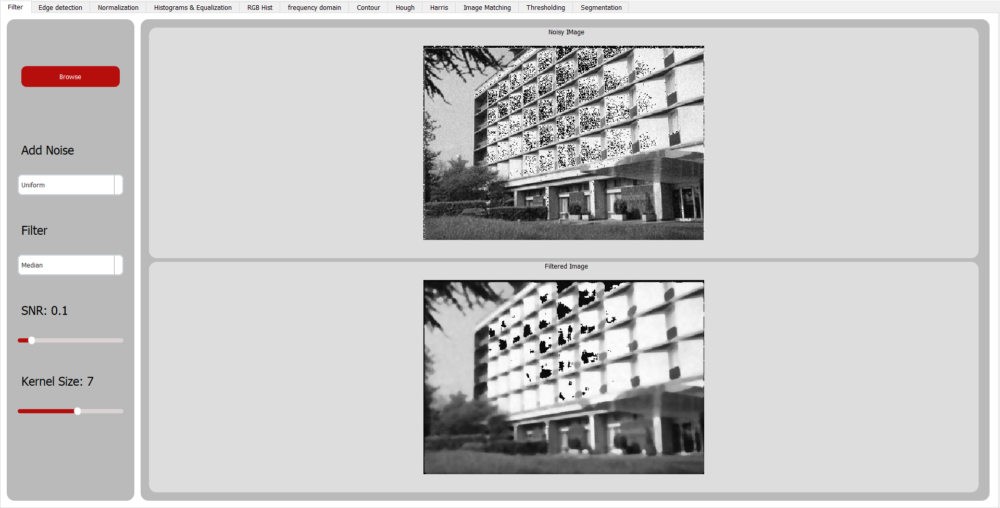

### 2. Edge Detection
Edge detection is crucial for understanding the structure within images. Users can detect edges using techniques such as **Sobel**, **Roberts**, **Prewitt**, and **Canny**. These methods are applicable along both the vertical and horizontal axes, allowing for precise edge identification.

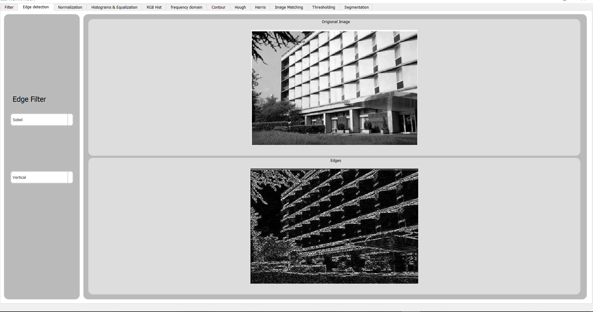

### 3. Normalization
The toolkit provides image normalization using both **Local** and **Global Thresholding** methods. This feature ensures that images are processed for uniform intensity, improving contrast and clarity.

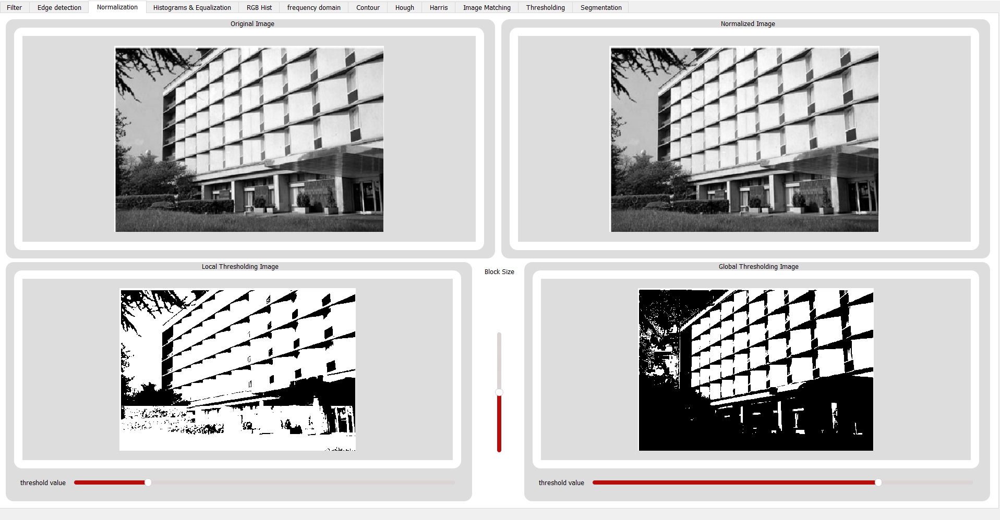

### 4. Histograms and Cumulative Distribution Function (CDF)
Users can visualize image data with histogram analysis. The toolkit offers both **Grayscale** and **RGB Histograms**, providing insights into pixel intensity distributions and color channels.

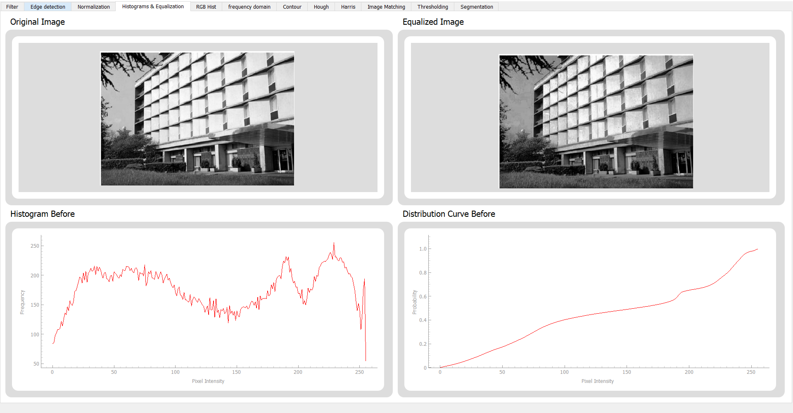
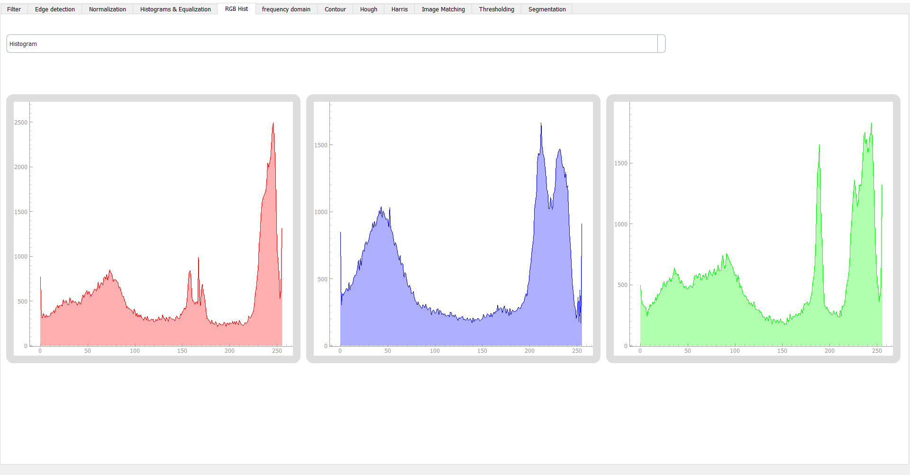

### 5. Image Mixer
The Image Mixer feature enables users to blend two images using **Fourier Transform** techniques. By applying low-frequency components from one image and high-frequency components from another, users can create unique and intriguing image compositions.

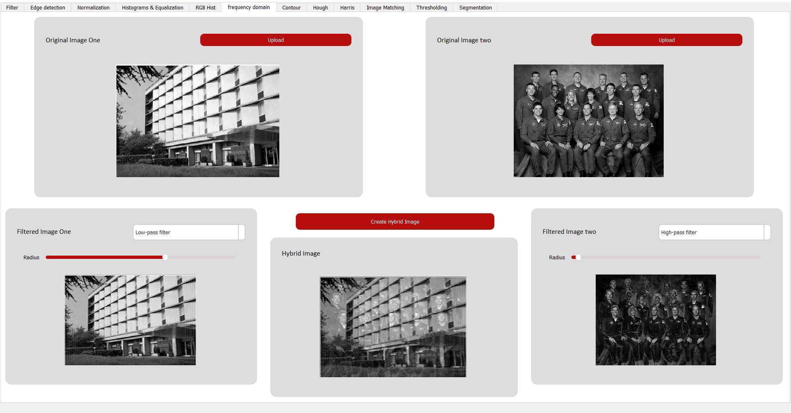

### 6. Active Contour
The Active Contour (also known as Snakes) feature allows users to detect object boundaries in images. This method is useful for segmenting and analyzing complex shapes in images.

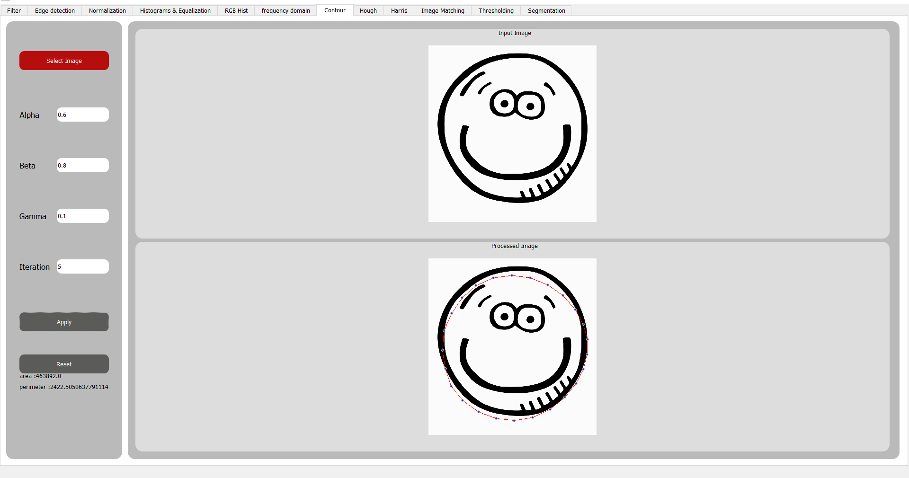

### 7. Hough Transform
The Hough Transform is available for detecting geometric shapes such as **lines**, **circles**, and **ellipses** in images. This powerful tool is essential for recognizing patterns and features in image analysis tasks.

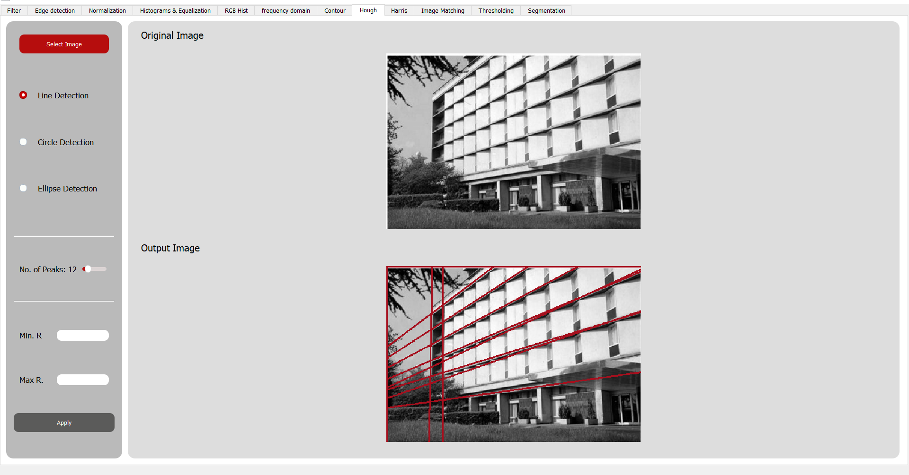

### 8. Harris and Lambda-minus
Users can perform corner detection using the **Harris** and **Lambda-minus** methods. These techniques are effective for identifying key points and features within an image, which are crucial for various computer vision applications.

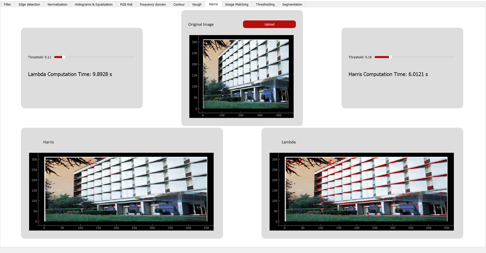

### 9. Image Matching
The toolkit supports image matching using two methods: **Sum of Squared Differences (SSD)** and **Normalized Cross-Correlation (NCC)**. These methods allow users to compare and align images based on their content and features.

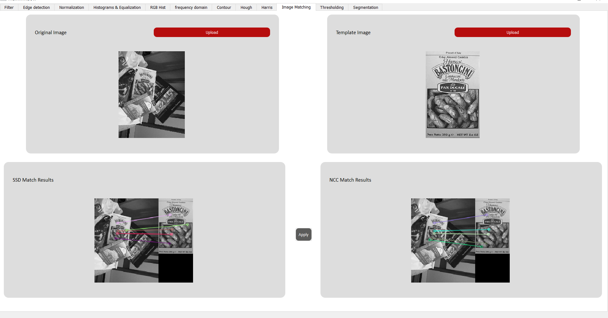

### 10. Thresholding
Advanced thresholding techniques such as **Optimal Thresholding**, **Otsu's Method**, and **Spectral Thresholding** are available to segment images based on intensity values, providing better contrast and object separation.

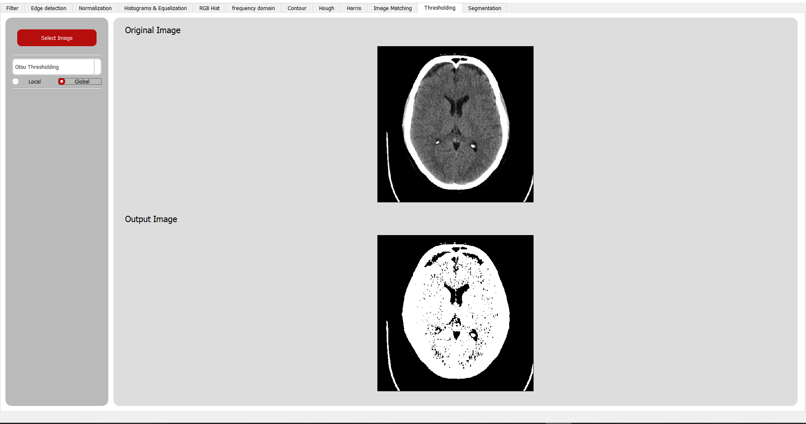

### 11. Segmentation
The toolkit includes several segmentation techniques, enabling users to divide images into meaningful regions. Supported methods include:
- **K-means Clustering**
- **Mean Shift**
- **Region Growing**
- **Agglomerative Clustering**

These segmentation tools are designed to identify and isolate objects within images for further analysis.

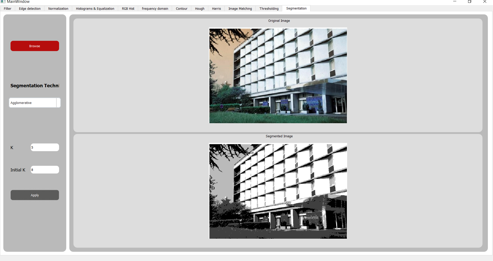

### 12. Face Detection
The toolkit offers a powerful **Face Detection** feature that can identify human faces in images. This capability is useful for applications ranging from security to user interaction.

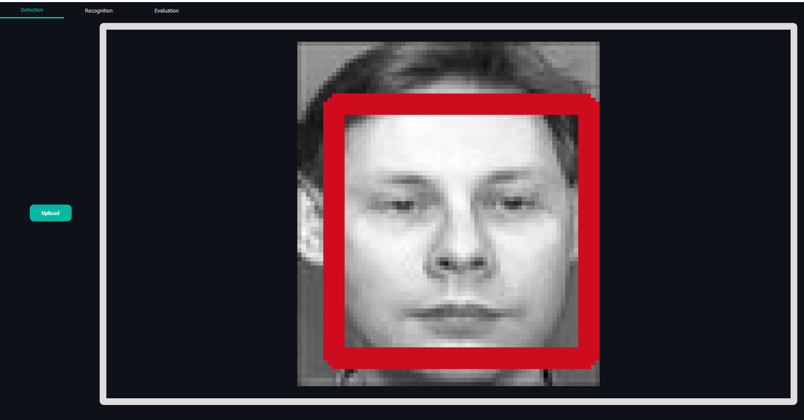

### 13. Face Recognition
Face Recognition is implemented using **Eigenfaces** based on eigenvalues. This method efficiently identifies and verifies faces by analyzing the significant features and variations in facial structures.

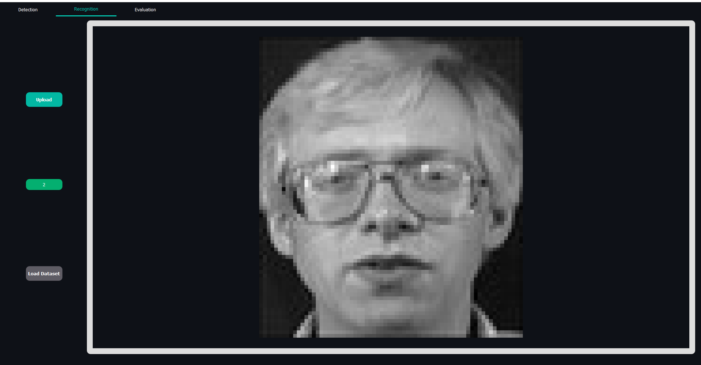

---

With these features, the Comprehensive Image Processing Tool provides a robust platform for a wide range of image processing and analysis tasks. Whether you're enhancing image quality, detecting edges, or performing advanced segmentation, this toolkit has you covered.

--- 
